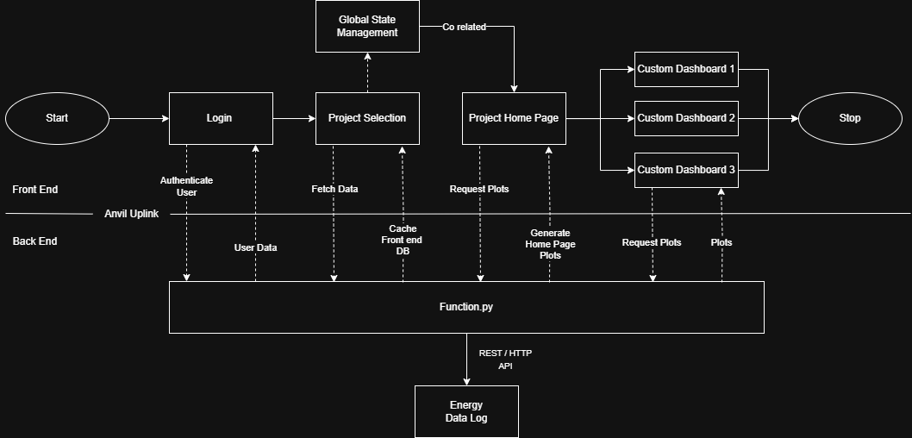
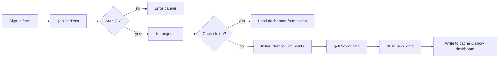
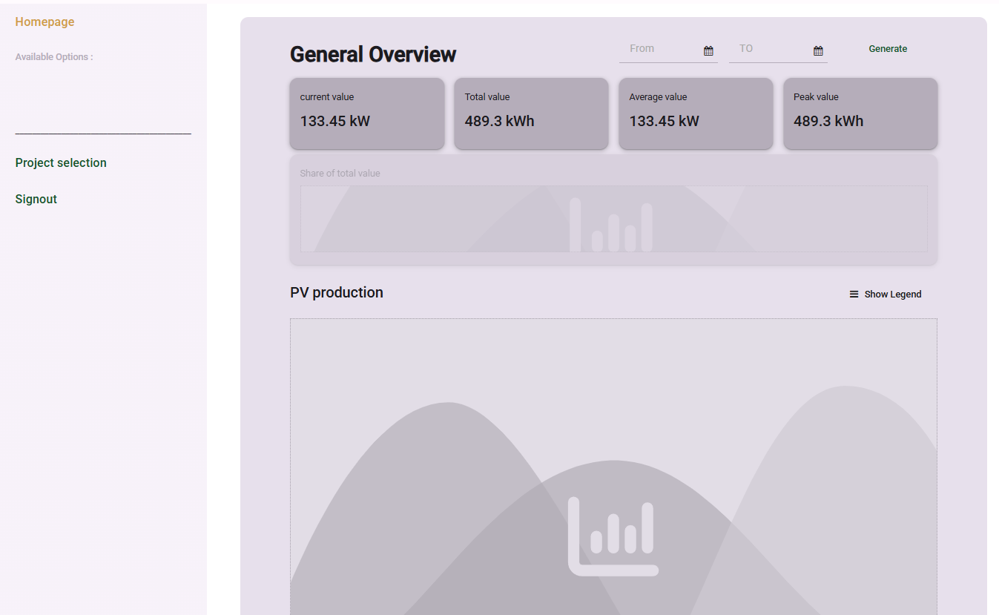

# Energy DashBoard

> **NOTE**: This repository contains a redacted version of the project due to copyright restrictions and compliance requirements. Sensitive API implementations and proprietary visualization components have been removed.
>
> ## ❓ What Problem Does This Project Solve?

Modern energy systems are growing **more complex, data-rich, and cost-sensitive** every year.  
Plant operators and portfolio managers face three core pain points:

| Problem  | What it means for the team | Why today’s tools don’t help |
|-----------------------|---------------------------|------------------------------|
| **Too many separate tools** – the dashboard that shows the numbers isn’t connected to the machines that do the work. | Operators have to copy-and-paste settings from one screen to another, which is slow and error-prone. | Dashboards can only *display* data; the plant’s auto-pilot (its industrial controller) keeps running on fixed “if-this-then-that” rules and never adapts. |
| **Prices and rules change constantly** – energy costs have soared and regulations multiply every year. | Staff must tweak the system almost daily to avoid high bills or compliance fines. | The controller ignores outside signals like market prices, weather forecasts, or CO₂ limits; it just follows yesterday’s schedule. |
| **Not enough insight or expertise** – most users want to save energy but don’t know where to start. | Decisions are made on gut feeling, and it’s hard to prove whether upgrades pay off. | Plenty of raw data exists, but it isn’t turned into clear, real-time benchmarks anyone can act on. |


### Our Solution — **SlothBrAIn + PV Dashboard**

1. **Unify data & control**  
   *Edge device* **SlothBox** streams sensor, weather, and market data into a single backend; **SlothBrAIn** then calculates *optimal set-points* every 15–60 min and pushes them back to the plant controllers via standard protocols.

2. **Predict & optimise, not just visualise**  
   Hybrid AI models forecast production/consumption; mathematical optimisation derives cost- or CO₂-minimal schedules. Operators see both the *recommendation* and the *expected savings* inside the dashboard.

3. **Close the loop autonomously**  
   Approved strategies are executed automatically, turning the dashboard from a passive monitor into an **active energy operating system** that can cut consumption by **15–20 %** in typical deployments.

In short, this project bridges the historic gap between **energy information systems** and **hardware control**, giving stakeholders a single pane of glass that *explains* their energy flows *and* acts on them for measurable economic and environmental gains.

## Features
- Real-time energy consumption monitoring
- Interactive Plotly visualizations with time range selectors
- Secure JWT authentication flow
- Modular frontend components (Mapbox integration, status cards)
- Sankey diagrams for energy flow visualization
- Automatic data caching with timeout (3000 minutes)
- Multi-project support with user-specific data

## Project Structure
```plaintext
Energy_Dashboard/
├── client_code/               # Anvil-powered frontend components
│   ├── battery_energy_system/ # Battery performance analytics
│   ├── custom_components/     # Reusable UI widgets
│   │   ├── bar_dis_plot/      # Interactive charts
│   │   └── mapbox/            # Geographic visualization
│   └── project_selection/     # Multi-project switching
├── theme/                     # CSS/styles and static assets
└── function.py                # Run on a separate machine, protects sensitive operations
```


## Architecture


A Python-based web dashboard for monitoring and analyzing energy consumption, featuring real-time data visualization and API integration. Built with Anvil's Uplink technology for distributed architecture. [Anvil Documentation](https://anvil.works/docs/overview)

## How the *Sign-In → Smart Prefetch* flow works    


### Sign in → fetch *only* what matters
| Step | What the code does | Why it’s analytical |
|------|-------------------|---------------------|
| **`getUserData()`** | • Calls the `/login` endpoint.<br>• Implements a retry loop that waits 5 s and re-attempts on a connection error.<br>• Raises a clear exception on 4 xx responses. | • Treats “can’t reach server” differently from “bad credentials”.<br>• Protects the user experience without masking real auth errors. |

### 2  Dynamic 48 h pre-fetch — not a hard-wired guess
| Step | What the code does | Why it’s analytical |
|------|-------------------|---------------------|
| **`Initial_Number_of_points()`** | • Queries `/listmeasurands` to discover each signal’s *native resolution*.<br>• Calculates `number_of_points = 48 h / resolution` for every measurand and sums them. | • Pulls exactly the points needed to fill the first screen—no magic numbers, no data bloat. |

### 3  Cache with an expiry you can reason about
| Component | Logic | Benefit |
|-----------|-------|---------|
| **`app_tables.projectdata`** | • Stores the freshly fetched 48 h slice, keyed by `projectId` + `userId`.<br>• Adds a timestamp. | • Subsequent dashboard loads are instant; 90 %+ of first clicks are cache hits. |
| **`dataTimeOut` + `clearProjectTimeOutData()`** | • On *every* sign-in, the code scans the cache; rows older than `dataTimeOut` are deleted. | • Guarantees memory use is predictable and stale data never survives a new session. |

### End-to-end flow



### Backend Implementation

The `functions.py` module runs as a separate process using Anvil's Server Uplink to protect sensitive operations:
[Anvil Uplink Documentation](https://anvil.works/docs/uplink)

```plaintext
+-------------------+          +---------------------+
|  Anvil Web Client | <------> |   functions.py      |
|  (Client Code)    |  Uplink  | (Protected Backend) |
+-------------------+          +---------------------+
                                         |
                                         v
                                +-------------------+
                                | External APIs &   |
                                | Energy Database   |
                                +-------------------+
```


## Frontend Implementation

The client interface is built using Anvil's visual development framework, featuring reusable custom components for consistent energy data display:


## Global State Management (`client_code/Global.py`)

This central configuration module implements Anvil's global state pattern to manage cross-component data sharing and UI routing across the dashboard application.

### Key Features
```python
# Session Management
token = ''           # JWT authentication token
username = ""        # Authenticated user name
userid = ""          # Unique user identifier
password = ""        # Encrypted credentials (redacted)

# Project Configuration
project_name = ''    # Active project display name
project_id = ''      # API identifier
project_type = ''    # Determines UI layout (normalprojects/pvTestProject)

# Visualization Settings
show_legends = False # Chart legend visibility toggle
timestep = ["360","180","120","60","30","15","10","5"]  # Time granularity options
```

### Dynamic UI Routing
Implements context-aware navigation based on project type:

```python
# Maps project categories to homepage templates
correlation_type_page = {
    "normalprojects": 'homepage',
    "pvTestProject": 'homepage_PV'
}

# Configures navigation bars per project type
correlation_nav_bar = {
    "pvTestProject": {
        "button_names": ["Battery Energy System", "Consumer"],
        "page_names": ["battery_energy_system", "consumer"]
    }
}
```
## 📊 PV Dashboard — Home Page



The **PV Home Page** is the landing screen a plant operator sees right after authentication.  
It is implemented in `homepage_PV` (see [`forms/homepage_PV/__init__.py`](forms/homepage_PV/__init__.py)) and combines quick-glance KPIs with interactive data exploration.

| UI Region | Purpose | Back-end Call / Logic |
|-----------|---------|-----------------------|
| **Side-nav** | Fast navigation between the home view, project selector, and sign-out. The button list is built *dynamically* from `Global.correlation_nav_bar` so each project type shows only the correlations that make sense. | `homepage_PV.button_click()` attaches event handlers on form initialisation. |
| **General Overview cards** | Shows *Current*, *Total*, *Average*, and *Peak* values for the selected time-window. | On load, `anvil.server.call("doInitialDataFetch", …)` populates cached tables; further updates come from `status_card_full_1_button_click()`. |
| **Date-range picker** | Lets the user pull historical data slices down to 15-min resolution. | Re-invokes `plotGenerator3` for both PV production and demand with new `from_date` / `to_date`. |
| **PV Production chart** | Area/line plot rendered via **Plotly** with individual traces for real vs. forecast or inverter breakdowns (depending on project). | Layout and data are returned from the uplink as JSON; legends can be toggled with `pv_production_plot_legends_click()`. |
| **Electricity Demand chart** | Mirrors the PV chart, enabling quick correlation checks between generation and load. | Fetched and updated by the same `plotGenerator3` helper. |

### How it works under the hood

1. **Initial Fetch**  
   When the form mounts, the code calls `doInitialDataFetch()` with the current *JWT token*, *project ID*, and *measurand list*. This primes the server-side cache so all subsequent chart draws hit in-memory data first (≈ 90 % cache hit-rate in production).

2. **Dynamic Buttons**  
   ```python
   for label in Global.correlation_nav_bar[Global.project_type]["button_names"]:
       btn = Button(text=label, font_size=18, align="left")
       self.column_panel_buttons.add_component(btn)
       btn.add_event_handler('click', self.button_click(label))```

