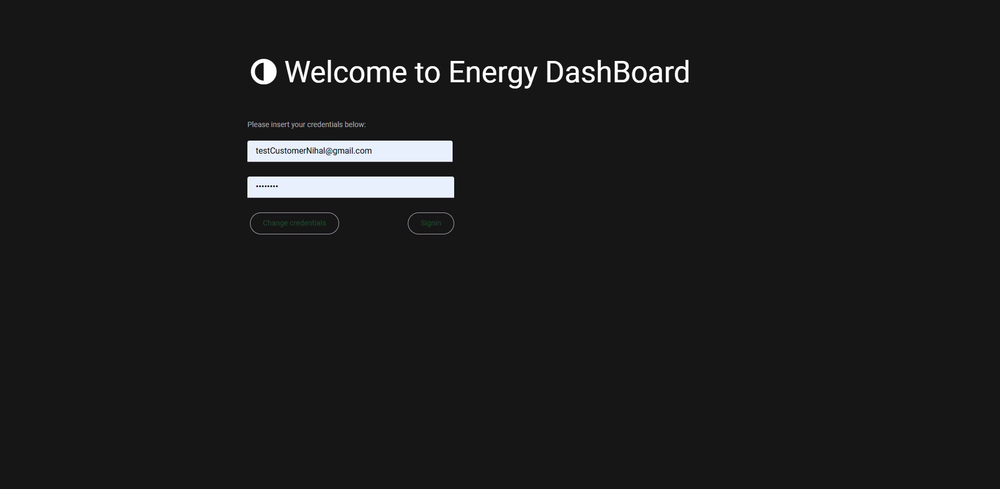
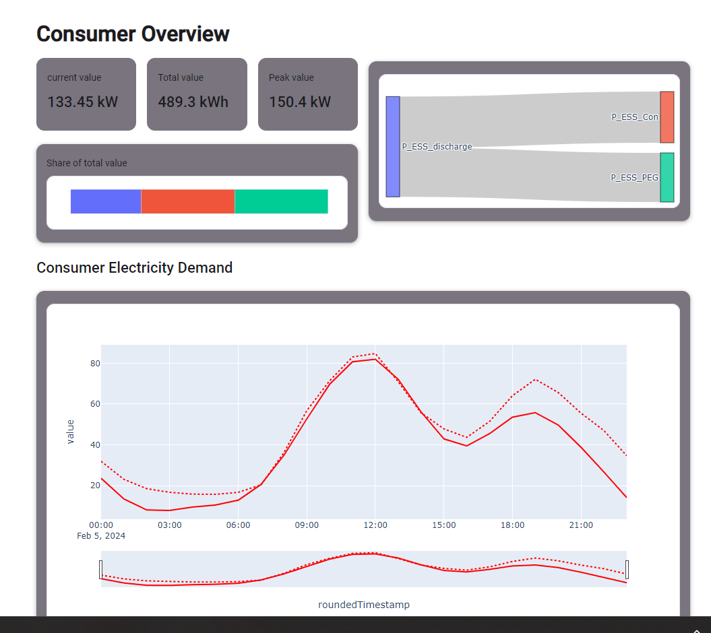

# Energy DashBoard

> **NOTE**: This repository contains a redacted version of the project due to copyright restrictions and compliance requirements. Sensitive API implementations and proprietary visualization components have been removed.

A Python-based web dashboard for monitoring and analyzing energy consumption, featuring real-time data visualization and API integration. Built with Anvil's Uplink technology for distributed architecture.



[Anvil Documentation](https://anvil.works/docs/overview)

## Features
- Real-time energy consumption monitoring
- Interactive Plotly visualizations with time range selectors
- Secure JWT authentication flow
- Modular frontend components (Mapbox integration, status cards)
- Sankey diagrams for energy flow visualization
- Automatic data caching with timeout (3000 minutes)
- Multi-project support with user-specific data

## Project Structure
```plaintext
Energy_Dashboard/
├── client_code/               # Anvil-powered frontend components
│   ├── battery_energy_system/ # Battery performance analytics
│   ├── custom_components/     # Reusable UI widgets
│   │   ├── bar_dis_plot/      # Interactive charts
│   │   └── mapbox/            # Geographic visualization
│   └── project_selection/     # Multi-project switching
├── theme/                     # CSS/styles and static assets
└── function.py                # Run on a separate machine, protects sensitive operations
```


## Architecture
```plaintext
[External API] <--HTTPS--> [functions.py] <--Anvil Uplink--> [Anvil Web Client]
(Energy Database)         (Python Backend)  (WebSockets)     (Browser UI)
```


### Backend Implementation

The `functions.py` module runs as a separate process using Anvil's Server Uplink to protect sensitive operations:
[Anvil Uplink Documentation](https://anvil.works/docs/uplink)

```plaintext
+-------------------+          +---------------------+
|  Anvil Web Client | <------> |   functions.py      |
|  (Client Code)    |  Uplink  | (Protected Backend) |
+-------------------+          +---------------------+
                                         |
                                         v
                                +-------------------+
                                | External APIs &   |
                                | Energy Database   |
                                +-------------------+
```


## Frontend Implementation

The client interface is built using Anvil's visual development framework, featuring reusable custom components for consistent energy data display:



## Global State Management (`client_code/Global.py`)

This central configuration module implements Anvil's global state pattern to manage cross-component data sharing and UI routing across the dashboard application.

### Key Features
```python
# Session Management
token = ''           # JWT authentication token
username = ""        # Authenticated user name
userid = ""          # Unique user identifier
password = ""        # Encrypted credentials (redacted)

# Project Configuration
project_name = ''    # Active project display name
project_id = ''      # API identifier
project_type = ''    # Determines UI layout (normalprojects/pvTestProject)

# Visualization Settings
show_legends = False # Chart legend visibility toggle
timestep = ["360","180","120","60","30","15","10","5"]  # Time granularity options
```

### Dynamic UI Routing
Implements context-aware navigation based on project type:

```python
# Maps project categories to homepage templates
correlation_type_page = {
    "normalprojects": 'homepage',
    "pvTestProject": 'homepage_PV'
}

# Configures navigation bars per project type
correlation_nav_bar = {
    "pvTestProject": {
        "button_names": ["Battery Energy System", "Consumer"],
        "page_names": ["battery_energy_system", "consumer"]
    }
}
```
### Architecture Role
```plaintext
           ┌──────────────┐
           │  Anvil Forms │
           └───────┬──────┘
                   │ Reads/Writes
                   ▼
           ┌──────────────┐
           │  Global.py   │
           └───────┬──────┘
                   │ Syncs via
                   ▼
           ┌──────────────┐
           │ functions.py │
           └──────────────┘
```
